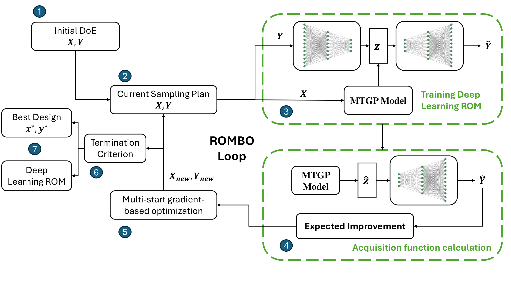

# ROMBO: A composite Bayesian optimization framework for engineering design using nonintrusive reduced-order models

<p align="center">

</p>

ROMBO is a optimization framework that utilizes a composite function formulation and nonlinear nonintrusive reduced order models. An autoencoder neural network is used to 
project high dimensional outputs into a latent space. The latent space is modeled using multi-task Gaussian process models that utilize a Kronecker structure or intrinsic model coregionalization (ICM) formulation. The framework uses a Monte Carlo expected improvement infill strategy to balance exploration of the design space with exploitation of the objective function. A linear POD method is also implemented using the same structure as ROMBO but using POD for dimensionality reduction and independent GP models for the latent space. A standard BO implementation is also provided for generating comparison data for the ROMBO framework. The framework is built utilizing PyTorch and associated libraries such as GPyTorch and BoTorch. Modular base classes have been provided for users to implement their own ROM architectures and utilize them within this framework.

## Installation

The ROMBO code can be installed in your Python environment using pip according to the following steps:

- Clone or download the latest code from this repository. 
- Open the terminal and ``cd`` into the root of cloned/downloaded repository
- Activate the virtual environment and run::

    pip install .
- Alternatively, run the following to install the package in development mode::

    pip install -e .

## Training a simple nonintrusive reduced order model using autoencoders and GP models

The following example code demonstrates how the ROMBO framework modules can be used to define a deep learning ROM model and train it to predict the environment model function using
the corresponding test problem class. First, the relevant modules must be imported from ROMBO and other Python packages. 

```python
import torch 
import numpy as np
from smt.sampling_methods import LHS
from rombo.dimensionality_reduction.autoencoder import MLPAutoEnc
from rombo.rom.nonlinrom import AUTOENCROM
from rombo.test_problems.test_problems import EnvModelFunction
from botorch.models import KroneckerMultiTaskGP
from gpytorch.mlls import ExactMarginalLogLikelihood
```

A problem class is evaluated using one of the test problems defined in ROMBO.The SMT package is used to generate a latin hypercube sampling (LHS) plan 
and the samples are evaluated using the evaluate method of the test problem class. A set of testing data is also generated in a similar manner. 

```python
# Defining environment model function 
problem = EnvModelFunction(input_dim = 15, output_dim = 1024, normalized = True)

# Creating the training data
n_data = 50
xlimits = np.array([[0.0, 1.0]]*problem.inputdim)
sampler = LHS(xlimits=xlimits, criterion="ese")
xtrain = sampler(n_data)
xtrain = torch.tensor(xtrain, **tkwargs)
htrain = problem.evaluate(xtrain).flatten(1)

# Generating the test data
test_sampler = LHS(xlimits=xlimits, criterion="ese")
xtest = test_sampler(10)
xtest = torch.tensor(xtest, **tkwargs)
htest = problem.evaluate(xtest).flatten(1)
```

The autoencoder architecture is defined using `MLPAutoEnc` which is a simple fully-connected autoencoder network defined in ROMBO. A user may also define their own architecture using PyTorch and use it along with the ROM model class within the ROMBO framework. After defining the autoencoder, the `AUTOENCROM` class can be used to define a ROM model with the corresponding training data and GP model. The GP model, `KroneckerMultiTaskGP`, and the corresponding likelihood functio, `ExactMarginalLogLikelihood`, are imported from the BoTorch package which contains GP models built using GPyTorch. The `AUTOENCROM` module combines the various inputs and automates the process of setting up the rom model.  

```python
# Generating the nonlinear ROM model
autoencoder = MLPAutoEnc(high_dim=problem.output_dim, hidden_dims=[256,64], zd = 10, activation = torch.nn.SiLU())
rom = AUTOENCROM(xtrain, htrain, autoencoder = autoencoder, low_dim_model = KroneckerMultiTaskGP, low_dim_likelihood = ExactMarginalLogLikelihood)
```

The ROM that is generated can be trained on the training data using the `trainROM` method and the predictions can be generated on the testing data using the `predictROM` method. 

```python
# Training the ROM and predicting on the test data
rom.trainROM(verbose=False)
field = rom.predictROM(xtest)
```

## Running the example optimization cases for the ROMBO framework

The `examples` folder contains the test cases that were used to characterize the ROMBO framework. Each of the scripts included in the folder also serve as an example of how to use the ROMBO framework to perform optimization. Running the example files as is will reproduce results that are similar to the ones included in the publication for the ROMBO framework. For example, to run the example that utilizes BO and ROMBO for optimizing the Environment Model Function (EMF), ``cd`` into the examples folder and run the following from the terminal::

    python env_model_function_bo.py --input_dim 15 --output_dim 1024 --latent_dim 10 --mc_samples 32 --trial_num 1

This will run the EMF case with the standard BO method and ROMBO method using a latent dimension of 10 and 32 Monte Carlo samples. The options entered in the terminal can be changed to run different trials and variants of the test cases. Other test cases can be run in a similar manner. To find out more about the options for each test case, simply type the following in the terminal after entering the examples folder.  

    python <example_script> -h
